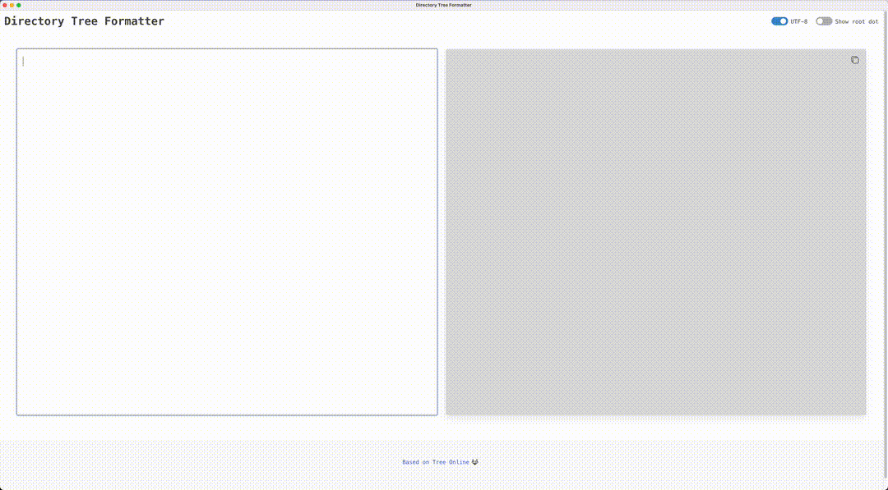

# Electron Tree
An Electron app for creating directory-tree diagrams.



### Releases
A DMG for macOS is available under releases. Installers for other operating systems can be generated using Electron's build script via ```npm run build```.

### Developing
Clone this repository, install all dependencies using ```npm install```, then create a local development server using Vite via ```npm run dev```.

### Building
The ```npm run build``` script will run Vite to bundle the app's front-end, then Electron Builder to generate an installer for the provided operating system (or your OS by default).